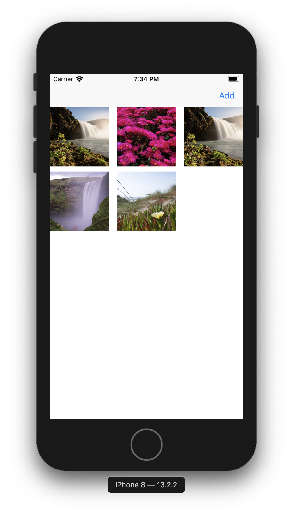

# iOS Coding Challenge - Spark Networks.

## Author:- Ankur Arya
email: <ankur.arya@me.com>

## Overview

This project contains two screens.
  - Gallery Screen:- This screen shows an add button (when there is no photo) to add photos from "Photo Library" or "Camera". Once the user adds any photo it is shown on the same screen in a grid layout.
  - Full Image Screen:- User can navigate to this screen by tapping on any image. A full-screen image is shown in this view. 

## Architecture

This project follows Clean Architecture with MVVM.
  - Domain: It consists of the domain entity, repo, and use case. The Decorator pattern is used to add Analytics.
  - Data: It contains the concrete implementation of the ImageRepo:- ImagesDBRepo (implemented using Core Data) and ImagesWebRepo(Not implemented). 
  - Router: Handles navigation logic for which screens should appear and when.
  - Presentation: This contains the presentation model which is used in the view. Also, it contains ViewModel and Controllers. 

## Get Started

This project uses CocoaPods for dependency management. Please open the .xcworkspace in Xcode 11.0 or above. It should work right out of the box.
However, if you face any issue in building or running the project please run pod install command.

## Dependencies

  - This sample app requires minimum iOS 13 and Xcode 11 to run.
  - This project also uses RxSwift, and Firebase which are added as a pod using CocoaPods.

## Screenshots

